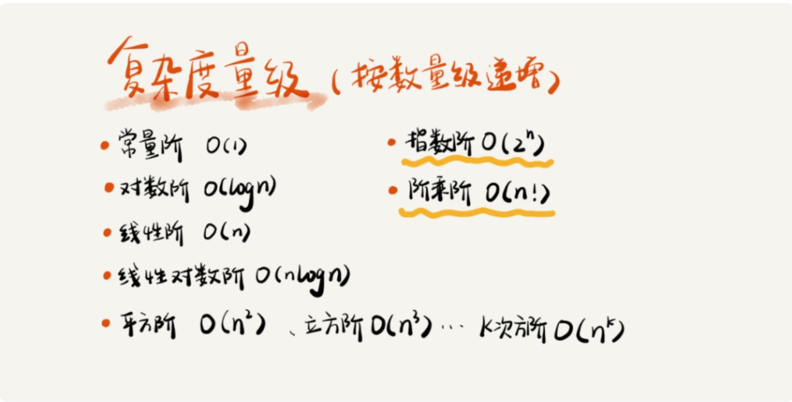
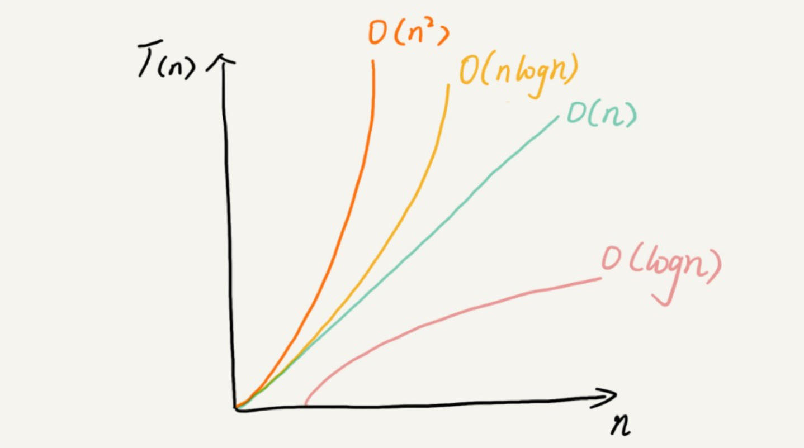

### 1、大O复杂度表示法

#### 1.1 大O时间复杂度表示法

> 大O时间复杂度实际上并不具体表示代码真正的执行时间，而是表示代码执行时间随数据规模增长的变化趋势，也叫渐进时间复杂度；

#### 1.2 时间复杂度分析的方法

+ 只关注循环执行次数最多的一段代码
+ 加法法则：总复杂度等于量级最大的那段代码的复杂度
+ 乘法法则：嵌套代码的复杂度等于嵌套内代码复杂度的乘积

#### 1.3 几种常见的时间复杂度



#### 1.5 空间复杂度分析

> 表示算法的存储空间与数据规模之间的增长关系

```c
 void print(int n){
	int i = 0;
	int[] a = new int[n];
	for(i;i<n;i++){
		a[i] = i * i;
	}
	for(i=n-1;i>=0;i--){
		printf(a[i]);
	}
}
```

#### 1.5 复杂度的变化趋势

