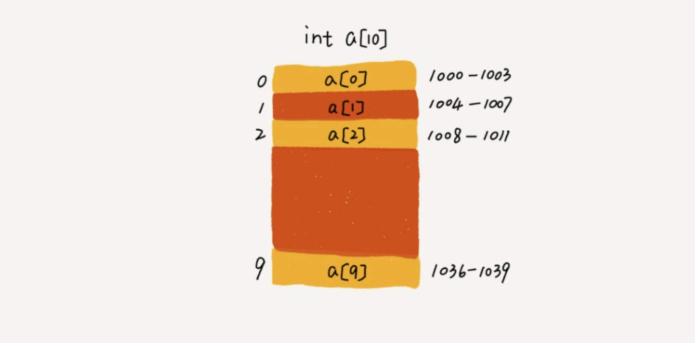
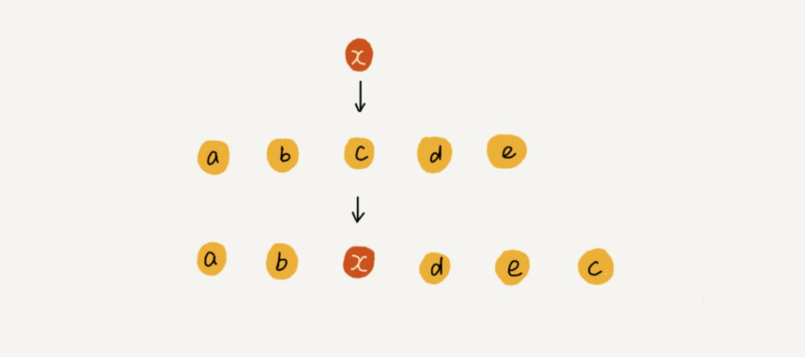

### 数组

#### 1、 如何实现随机访问

> 数组是一种线性数据结构，它用一组【连续的内存空间】，来存储一组具有【相同类型】的数据



> 假设数组被分配的内存块的首地址： base_address = 1000;
>
> data_type_size : 数组中每个元素的大小；
>
> i:元素在数组中的下标；

```
 a[i]_address = base_address  + i * data_type_size;
```

##### 1.1 二维数组的内存寻址

```
m * n 的数组；a[i][j](i<m,j<n)的地址:

address = base_adddress + (i * n + j) *  type_size;
```


#### 2、数组与链表的区别

> 链表适合删除和插入操作时间复杂度是 O（1）；
>
> 数组支持随机访问，根据【下标随机访问】的时间复杂度是 O（1）；

#### 3、数组低效的插入和删除

##### 3.1 插入操作

+ 若在数组的末尾直接插入则时间复杂度为O（1）

+ 若数组有序，在数组中间某一个位置插入，涉及移动插入位置后面的所有元素，时间复杂度为O（n）

+ 若数组无序，可以将待插入位置K的元素移动到数组末尾，然后将新元素放在位置K处，这样时间复杂度能降低到O（n）

  

  ##### 3.2 删除操作

  > 删除操作类似插入；
  >
  > 但在优化时间复杂度的情况话，可以先记录待删除的数组元素位置，设置删除触发的条件【例如：当待删除元素累计个数为n时执行统一的删除操作】

  

#### 4、C语言运行代码分析

> 以下代码在不同的编译器下执行结果不一样；

```c
int main(int argc, const char * argv[]) {
    int i = 0;
    int arr[3] = {0};
    for(; i<=3 ; i++){
        arr[i] = 0;
        printf("%d",arr[i]);
    }
    return 0;
}
```

##### 4.1 存在无限循环的情况

> 解释1：
>
> 函数体内的局部变量存在栈上，且连续压栈，在Linux进程的内存布局中，栈区在高地址空间，从高向低增长，变量i和arr在相邻位置，且i比arr的地址大，所以arr越界正好可以访问到i；

