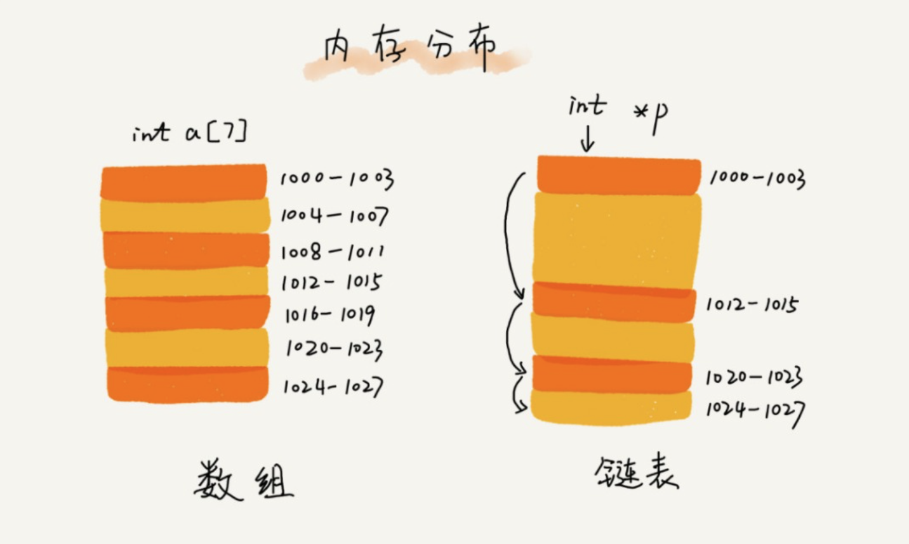
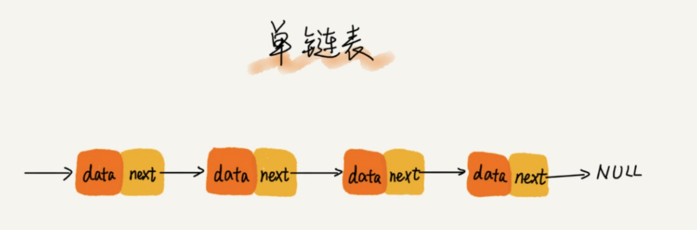
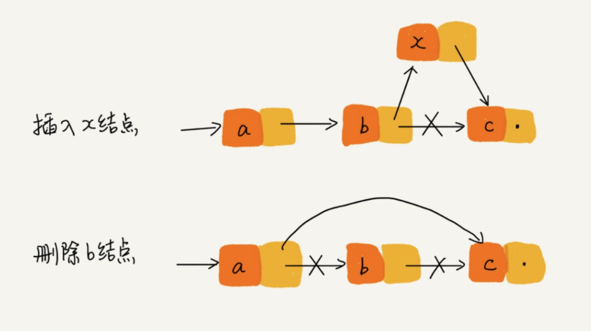
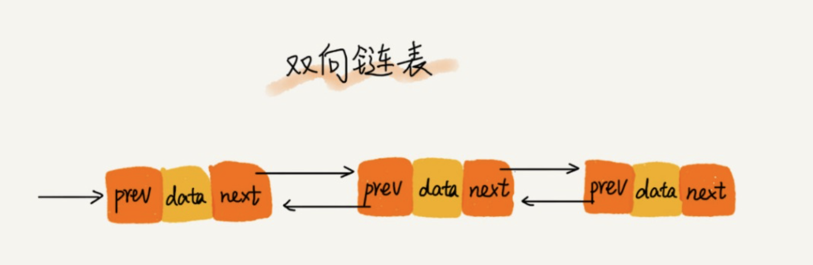
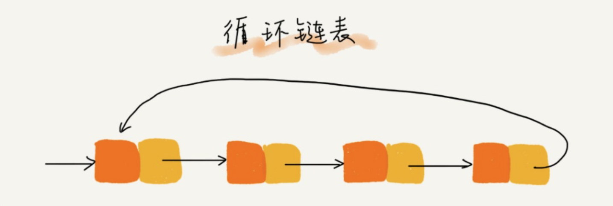
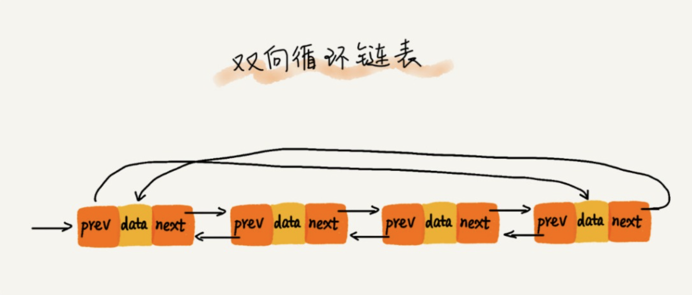

### 链表

#### 1、数组与链表的对比

##### 1.1 底层的存储结构

> 数组：需要的是连续的内存空间进行存储；
>
> 链表：通过“指针”将一组零散的内存块串联起来使用

##### 1.2 链表与数组性能对比

#### 2、链表的种类

##### 2.1 单链表

> 链表通过指针将一组零散的内存块串联在一起。
>
> 结点：“内存块”，存储数据 + 记录下一个结点的地址（后继指针）

> 头结点：记录链表的基地址，
>
> 尾结点：链表的最后一个结点，指向一个空地址NULL

##### 2.2 单链表的结点插入与删除

##### 2.2 双向链表

> 每个结点不止有一个后继指针next指向后面的结点，还有一个前继指针prev指向前面的结点

##### 2.3 循环链表

##### 2.4 双向循环链表

#### 3、链表的应用

##### 3.0 链表的增删改查

##### 3.1 基于链表实现LRU缓存淘汰算法

> 维护单链表，越靠近链表的尾部的结点是越早之前访问的；当有新的数据访问时，从头部开始遍历链表；
>
> 1、当访问的数据存在链表中，则将其从原来位置删除，并插入到链表的头部；
>
> 2、如果数据没有在链表中：
>
>   2.1： 如果此时缓存数据的链表未满，则直接插入到链表的头部
>
>   2.2 ：如果此时缓存数据的链表满了，则删除链表的尾结点，将数据结点插入链表的头部

##### 3.2 如何判断是回文字符串

> 快慢指针操作；

##### 3.3 单链表反转

##### 3.4 链表中环的检测

##### 3.5 两个有序链表的合并

##### 3.6 删除链表倒数第n个结点

##### 3.7 求链表的中间结点

##### 3.8 leetcode

> 206 141 21 19 876