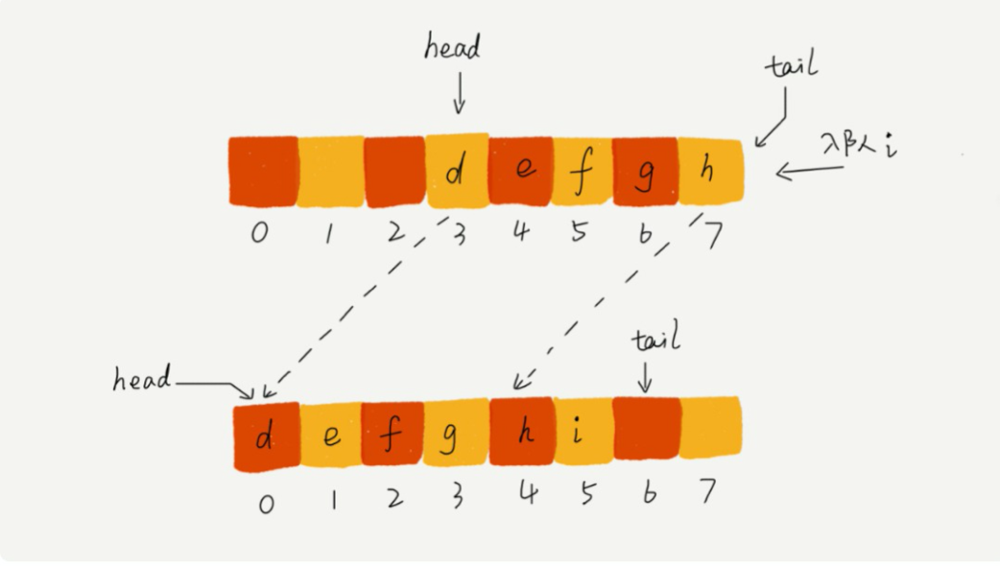
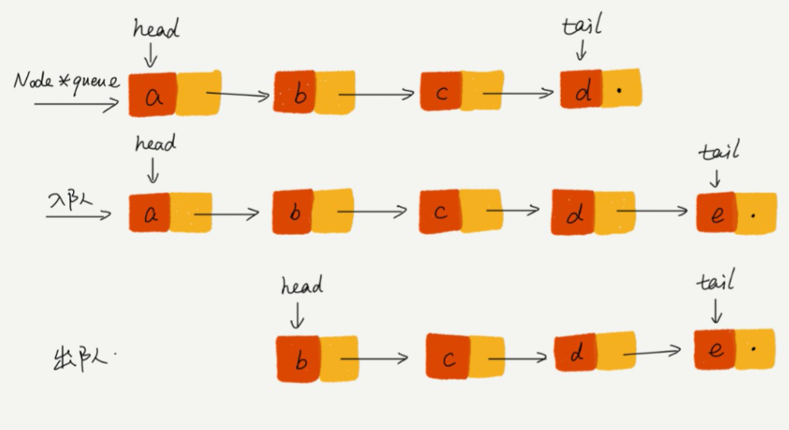
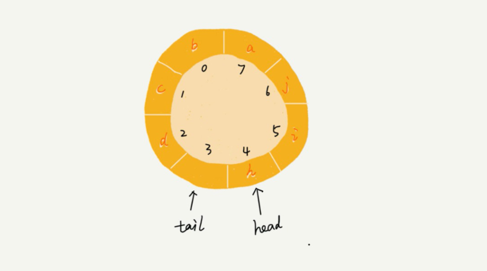

### 5、队列

#### 5.1 队列

> 先进者先出，基本的操作包含：入队和出队操作

#### 5.2 基于数组实现的队列

> 使用数组存储队列可以用：head（队头坐标）、tail（队尾坐标）

##### 5.2.1 入队列的优化操作

> 出队列时不需要搬移元素，等到队列空间不足时，再统一搬一次数据

#### 5.3 基于链表实现的队列

#### 5.4 循环队列

> 队列满时：（tail + 1）% n = head