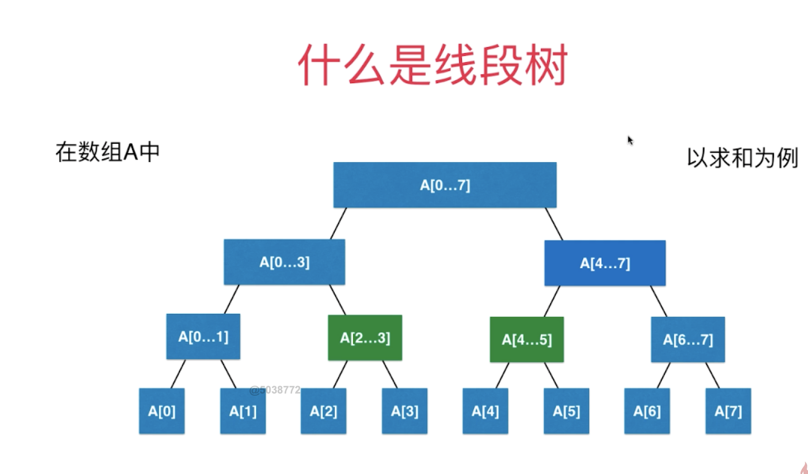

### 线段树（SegmentTree）

#### 1、什么是线段树？

> 线段树是一种二叉搜索树，与【区间树】类似；它将一个区间划分成一些单元区间，每个单元区间对应线段树的一个叶结点; 
>
> 对于线段树中的每一个非[叶子节点](https://baike.baidu.com/item/叶子节点)[a,b]，它的左儿子表示的区间为[a,(a+b)/2]，右儿子表示的区间为[(a+b)/2+1,b]。因此线段树是[平衡二叉树](https://baike.baidu.com/item/平衡二叉树)，最后的子节点数目为N，即整个线段区间的长度。



#### 2、为什么要使用线段树？

> 1、经典的线段树问题：区间染色
>
> 有一面墙，长度为n，每次选择一段墙进行染色；
>
> M次（1~5：染红色，3~7：染绿色，5~9：染黄色）操作后，还可以看到多少种颜色？
>
> M次操作后，【i，j】区间内可以看见多少种颜色？
>
> 2、区间查询：
>
> 基于区间的统计查询

#### 3、线段树的基本操作

> 对于给定区间：
>
> 1. 更新区间中一个元素或者一个区间的值
> 2. 查询一个区间[i,j]的最大值，最小值，或者区间数字和

#### 4、如果区间有n个元素，用数组表示线段树需要有多少个结点？

> 对于满二叉树：
>
> 第0层，有1个结点，
>
> 第1层，有2个结点，
>
> 第2层，有4个结点，
>
> 第h-1层，有2^(h-1)个结点
>
> 那么总的结点数： 2^0 + 2^1 +...+2^(h-1) = 2^h - 1;
>
> 由此得出结论：**第h-1层的结点总个数 大致等于前（0 ~ h-2）层所有结点的和；**
>
> 如果 n = 2^k , 那么需要数组的空间则是（最后一层结点总数+除了最后一层所有结点的总和）：n + n = 2n
>
> 如果最坏的情况 n = 2^k + 1，那么需要数组的空间则是： 2n + n + n = 4n （比n = 2^k多出一层）


#### 5、如何构建线段树

> 将一个数组构建为线段树；线段树总结点的个数为数组长度的4倍；
>
> 因此需要一个数组Tree来存储所有的区间单元；

```java
  /*
    在treeIndex的位置创建表示区间[l...r]的线段树
    treeIndex代表当前线段树中的结点【也就是在数组tree中索引】
  */ 
  private void buildSegmentTree(int treeIndex,int l ,int r){
    // 1、递归构建线段树终止的条件为：结点的左右区间相等，如上图中的A[0],A[1]  
    if (l == r){
        tree[treeIndex] = data[l];// 此时线段树结点存储的值就是对应数组相应索引的值
        return;
    }
    // 2、获取[treeIndex]结点的左右孩子结点的索引
    int leftTreeIndex = leftChild(treeIndex);
    int rightTreeIndex = rightChild(treeIndex);
    // 3、获取区间的中间值
    int mid = l + (r - l) / 2; // 防止 r + l 整数的溢出
    // 4、递归创建左子树，区间为[l...mid]
    buildSegmentTree(leftTreeIndex,l,mid);
    // 5、递归创建右子树，区间为[mid+1...r]
    buildSegmentTree(rightTreeIndex,mid + 1,r);
    // 6、合并左右结点的值【合并规则：求和、求最大值、求最小值等】
    tree[treeIndex] = merger.merge(tree[leftTreeIndex],tree[rightTreeIndex]);
  }
```

#### 6、如何在线段树中查询一个区间

> 在线段树中一个结点包含：treeIndex（在tree数组中的索引），left（区间左侧），right（区间右侧）

```java
  // 在以treeIndex为根的线段树中[l...r]的范围里，搜索区间[queryL,queryR]的值
  private E query(int treeIndex, int l, int r , int queryL , int queryR){
      // 1、当前结点区间与查询区间匹配则直接返回当前结点的值
      if (l == queryL && r == queryR){
          return tree[treeIndex];
      }
      // 2、获取当前结点区间的中间值及当前结点左右孩子结点的索引
      int mid = l + (r - l) / 2;
      int leftTreeIndex = leftChild(treeIndex);
      int rightTreeIndex = rightChild(treeIndex);
      // 3、当查询的左侧区间大于或者等于当前结点的区间mid，则去当前结点的右子树去查询
      if (queryL >= mid + 1){
          return query(rightTreeIndex,mid+1,r,queryL,queryR);
      }
      // 4、当查询的右侧区间小于或者等于当前结点的区间mid+ 1，则去当前结点的左子树去查询
      else if (queryR <= mid){
          return query(leftTreeIndex,l,mid,queryL,queryR);
      }
      // 5、当前的区间被分割两个部分分别放在左右孩子结点
      E leftResult = query(leftTreeIndex,l,mid,queryL,mid);
      E rightResult = query(rightTreeIndex,mid+1,r,mid+1,queryR);
      return  merger.merge(leftResult,rightResult);
  }
```

#### 7、如何修改数组指定索引的值，并更新线段树？

```java
private void set(int treeIndex,int l,int r,int index,E e){
   // 1、 当递归的结点左右区间值相等则return  
  if (l == r){
        tree[treeIndex] = e;
        return;
    }
  // 2、获取区间的中间索引，以及当前结点的左右孩子结点
    int mid = l + (r - l) / 2;
    int leftTreeIndex = leftChild(treeIndex);
    int rightTreeIndex = rightChild(treeIndex);
  // 3、当修改数据的索引大于区间中间值，则递归修改右子树
    if (index >= mid + 1){
        set(rightTreeIndex,mid+1,r,index,e);
    }else{
  // 4、当修改数据的索引小于区间中间值，则递归修改左子树
        set(leftTreeIndex,l,mid,index,e);
    }
  // 5、更新线段树上的结点值
    tree[treeIndex] = merger.merge(tree[leftTreeIndex] , tree[rightTreeIndex]);
}
```

#### 8、线段树完全实现代码

##### 8.1 merge合并接口

```java
public interface Merger<E> {
    public E merge(E a,E b);
}
```

##### 8.2 SegmentTree类

```java

/*
*  线段树
* */
public class HZSegmentTree<E> {

    private E[] tree; // 存储区间数据
    private E[] data;// 存储基本数据
    private Merger<E> merger;

    public HZSegmentTree(E[] arr,Merger<E> merger){
        this.merger = merger;
        data = (E[])new Object[arr.length];
        for (int i = 0; i < arr.length; i++) {
            data[i] = arr[i];
        }
        tree = (E[])new Object[4 * arr.length];
        buildSegmentTree(0,0,data.length - 1);
    }

    // 在TreeIndex的位置创建表示区间[l...r]的线段树
    private void buildSegmentTree(int treeIndex,int l ,int r){
        if (l == r){
            tree[treeIndex] = data[l];
            return;
        }
        int leftTreeIndex = leftChild(treeIndex);
        int rightTreeIndex = rightChild(treeIndex);

        int mid = l + (r - l) / 2; // 防止 r + l 整数的溢出
        buildSegmentTree(leftTreeIndex,l,mid);
        buildSegmentTree(rightTreeIndex,mid + 1,r);

        tree[treeIndex] = merger.merge(tree[leftTreeIndex],tree[rightTreeIndex]);
    }

    public int getSize(){
        return  data.length;
    }

    public E get(int index){
        if (index < 0 || index >= data.length){
            throw new IllegalArgumentException("Index is illegal");
        }
        return data[index];
    }

    // 返回完全二叉树的数组表示中，一个索引所表示的元素的左孩子节点的索引
    private int leftChild(int index){
        return 2*index + 1;
    }
    // 返回完全二叉树的数组表示中，一个索引所表示的元素的右孩子节点的索引
    private int rightChild(int index){
        return 2*index + 2;
    }

    // 返回区间[queryL,queryR]的值
    public E query(int queryL, int queryR){

        if (queryL < 0 || queryL >= data.length || queryR < 0 || queryR >= data.length || queryL > queryR){
            throw  new IllegalArgumentException("index is illegal");
        }

        return query(0,0,data.length - 1,queryL,queryR);
    }

    // 在以treeID为根的线段树中[l...r]的范围里，搜索区间[queryL,queryR]的值
    // [int treeIndex, int l, int r] 代表了一个结点的信息
    private E query(int treeIndex, int l, int r , int queryL , int queryR){

        if (l == queryL && r == queryR){
            return tree[treeIndex];
        }

        int mid = l + (r - l) / 2;
        int leftTreeIndex = leftChild(treeIndex);
        int rightTreeIndex = rightChild(treeIndex);

        if (queryL >= mid + 1){
            return query(rightTreeIndex,mid+1,r,queryL,queryR);
        }else if (queryR <= mid){
            return query(leftTreeIndex,l,mid,queryL,queryR);
        }
        // 当前的区间被分割两个部分分别放在左右孩子结点
        E leftResult = query(leftTreeIndex,l,mid,queryL,mid);
        E rightResult = query(rightTreeIndex,mid+1,r,mid+1,queryR);
        return  merger.merge(leftResult,rightResult);
    }

    // 更新数组中指定索引的数据，同时更新线段树
    public void set(int index , E e){
        if (index < 0 || index >= data.length){
            throw  new IllegalArgumentException("index is error");
        }
        data[index] = e;

        set(0,0,data.length-1,index,e);
    }

    // 在以treeIndex为根的线段树中更新data数组中index的值为e
    private void set(int treeIndex,int l,int r,int index,E e){
        if (l == r){
            tree[treeIndex] = e;
            return;
        }

        int mid = l + (r - l) / 2;
        int leftTreeIndex = leftChild(treeIndex);
        int rightTreeIndex = rightChild(treeIndex);

        if (index >= mid + 1){
            set(rightTreeIndex,mid+1,r,index,e);
        }else{
            set(leftTreeIndex,l,mid,index,e);
        }

        tree[treeIndex] = merger.merge(tree[leftTreeIndex] , tree[rightTreeIndex]);
    }


    @Override
    public String toString() {
        StringBuffer res = new StringBuffer();
        res.append("[");
        for (int i = 0; i < tree.length ; i++) {
            if (tree[i] != null){
                res.append(tree[i]);
            }else{
                res.append("null");
            }
            if (i != tree.length - 1){
                res.append(',');
            }
        }
        res.append("]");
        return res.toString();
    }

  // 代码单元测试
    public static  void main(String[] args){
        Integer[] nums = {-2,0,3,-5,2,-1};
        HZSegmentTree<Integer> segmentTree = new HZSegmentTree<>(nums, new Merger<Integer>() {
            @Override
            public Integer merge(Integer a, Integer b) {
                return a + b;
            }
        });
        System.out.println(segmentTree.toString());

        System.out.println(segmentTree.query(0,2));
    }
}

```

