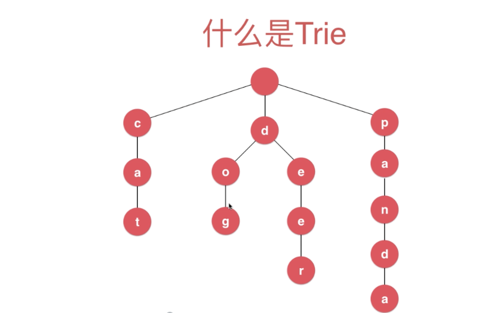

### 字典树（Trie）

#### 1、什么是字典树？

> 字典树又称为单词查找树，Trie树；
>
> 它的优点是：利用字符串的公共前缀减少查询时间，最大限度地减少无所谓的字符串的比较；



#### 2、Trie树的使用场景

> Trie树可以保存通讯录中的所有人名，
>
> 在查找某个人名的时候执行search操作，时间复杂度与查找人名（字符串）的长度有关：O(k);

#### 3、向Tire树中增加元素

```java
 // 向Trie中添加一个新的单词word
   public void insert(String word){
     // 1、获取Trie的根结点  
     Node cur = root;
     // 2、循环遍历单词的所有字符，将字符插入到Trie中
    for (int i = 0; i < word.length() ; i++) {
      // 3、获取单词当前的字符
        char c = word.charAt(i);
      // 4、判断当前结点的字典（TreeMap）中是否包含当前字符
        if (cur.next.get(c) == null){
           // 5、如果没有则在字典中新增一个结点
            cur.next.put(c,new Node());
        }
       // 6、字典中已包含当前字符，则向继续向下遍历
        cur = cur.next.get(c);
    }
     // 7、判断当前结点是否是一个单词（从根结点到cur是否是一个单词）
    if (!cur.isWord){
       cur.isWord = true;
       size ++;
    }
 }
```

#### 4、查找单词是否在Tire中

```java
 public boolean search(String word){
   // 1、从根结点开始遍历    
   Node cur = root;
   // 2、遍历字符串的所有字符
   for (int i = 0; i < word.length(); i++) {
      // 3、获取字符串的当前字符
       char c = word.charAt(i);
       // 4、判断当前获取的字符是否在结点的字典中
       if (cur.next.get(c) == null){
           return false;// 不能存在直接返回false
       }
       // 5、存在则继续向下遍历
       cur = cur.next.get(c);
   }
   // 6、如果单词整体遍历完成，返回当前结点是否为一个单词的标识
   return  cur.isWord; 
 }
```

#### 5、查找Trie中是否有以prefix为开头的单词

```java
public boolean startsWith(String prefix){
    // 1、从根结点开始遍历  
    Node cur = root;
    // 2、遍历字符串的所有字符
    for (int i = 0; i < prefix.length(); i++) {
        // 3、获取字符串的当前字符
        char c = prefix.charAt(i);
        // 4、判断当前获取的字符是否在结点的字典中
        if (cur.next.get(c) == null){
            return false;// 不能存在直接返回false
        }
        // 5、存在则继续向下遍历
        cur = cur.next.get(c);
    }
    // 6、当prefix遍历完成，则表示存在以prefix为开头的单词
    return true;
}
```

#### 6、Tire完整实现代码

```java
import java.util.TreeMap;

public class Trie {

    private class Node{

        public boolean isWord;// 截止到当前结点是否是一个单词
        public TreeMap<Character,Node> next; // 存储以当前字符开头的所有子节点

        public Node(boolean isWord){
            this.isWord = isWord;
            next = new TreeMap<>();
        }

        public Node(){
            this(false);
        }
    }

    private Node root;
    private int size;

    public Trie(){
        root = new Node();
        size = 0;
    }

    // 获取Trie中存储的单词数量
    public int getSize(){
        return size;
    }
    // 向Trie中添加一个新的单词word
    public void insert(String word){
        Node cur = root;
        for (int i = 0; i < word.length() ; i++) {
            char c = word.charAt(i);
            if (cur.next.get(c) == null){
                cur.next.put(c,new Node());
            }
            cur = cur.next.get(c);
        }
        if (!cur.isWord){
           cur.isWord = true;
           size ++;
        }
    }

   // 查询单词word是否在Trie中
   public boolean search(String word){

        Node cur = root;
       for (int i = 0; i < word.length(); i++) {
           char c = word.charAt(i);
           if (cur.next.get(c) == null){
               return false;
           }
           cur = cur.next.get(c);
       }
       return  cur.isWord; // 避免遍历都结尾不是一个单词的情况
   }
   
   // 查询是否在Trie中有单词以prefix为前缀
    public boolean startsWith(String prefix){

        Node cur = root;
        for (int i = 0; i < prefix.length(); i++) {
            char c = prefix.charAt(i);
            if (cur.next.get(c) == null){
                return false;
            }
            cur = cur.next.get(c);
        }
        return true;
    }
}
```

